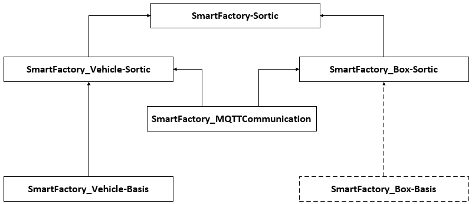
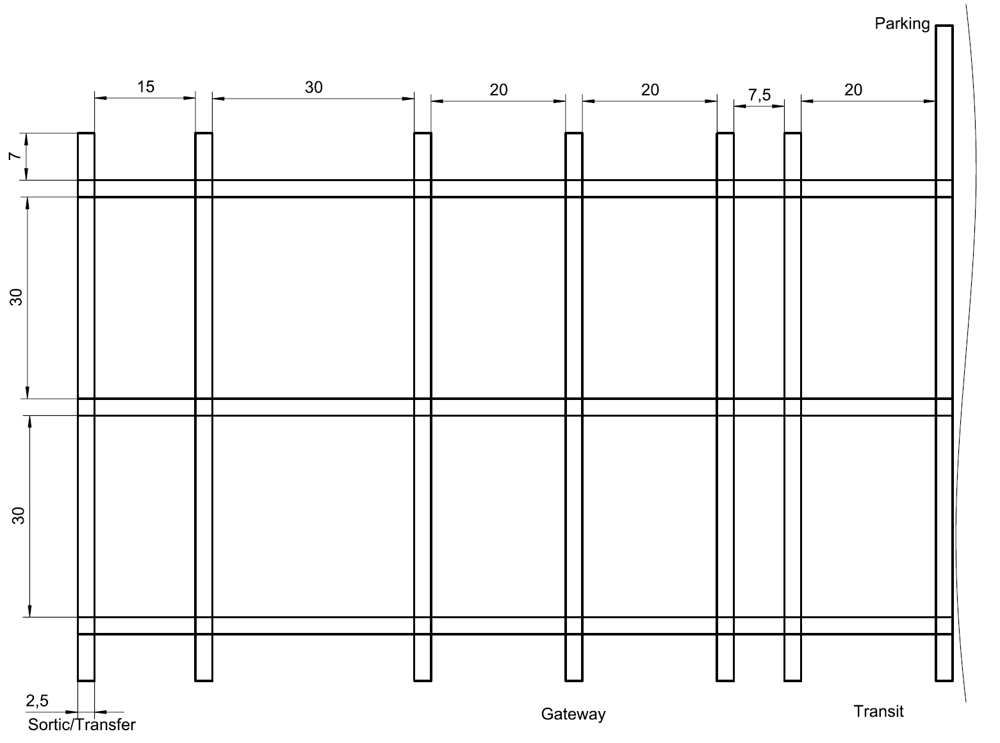
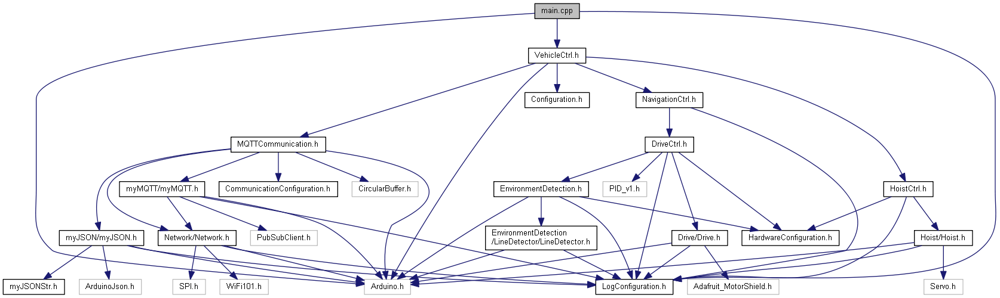
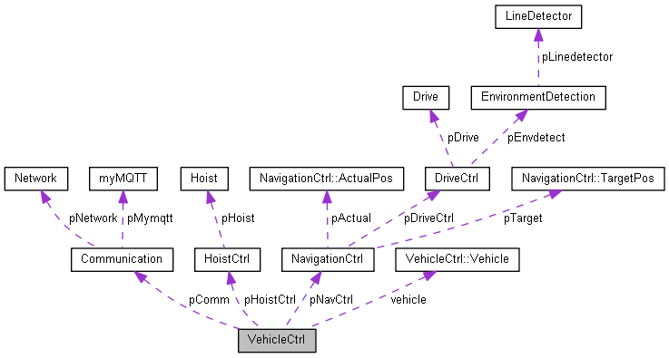
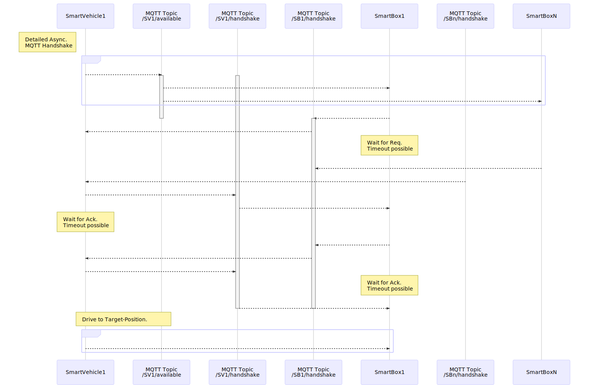
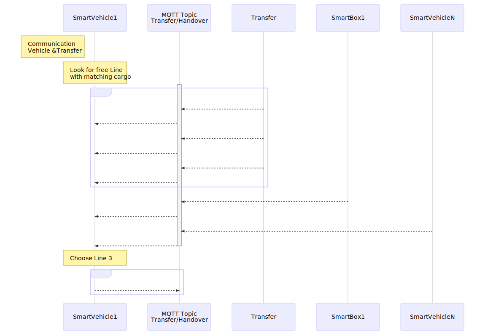

# SmartFactory_Vehicle-Sortic

The [SmartFactory_Vehicle-Sortic](<https://github.com/LMazzole/SmartFactory_Vehicle-Sortic>) is an implementation from the *SmartFactory* project for Sortic.

It's a Smart-Vehicle which can navigate on a known game-table and communicates this information wirelessly to its environment using the [SmartFactory_MQTTCommunication](https://github.com/LMazzole/SmartFactory_MQTTCommunication) and the [SmartFactory_Vehicle-Basis](<https://github.com/LMazzole/SmartFactory_Vehicle-Basis>)-component.

 Multiple nested Finite State Machines (FSM) based on the pattern of the [ArdFSM](<https://github.com/LMazzole/ArdFSM>) are used to control the processes.

<!-- add Pagebreak: 

 -->

## Table of contents

<!-- TOC Generated with https://magnetikonline.github.io/markdown-toc-generate/ -->

- [The SmartFactory project - Sortic](#the-smartfactory-project---sortic)
- [Tools and technologies](#tools-and-technologies)
	- [Doxygen](#doxygen)
	- [VSCode PlatformIO](#vscode-platformio)
	- [MQTT](#mqtt)
- [Documentation](#documentation)
	- [Hardware](#hardware)
	- [Gametable](#gametable)
	- [Software](#software)
		- [Dependency graph](#dependency-graph)
		- [Collaboration diagram](#collaboration-diagram)
		- [Important functions and files](#important-functions-and-files)
			- [Configuration.h](#configurationh)
		- [Communication](#communication)
			- [Handshake with box](#handshake-with-box)
			- [Transfer and vehicle](#transfer-and-vehicle)
- [FAQ's](#faqs)
	- [I'd like to use this code in my project. What do I need to know?](#id-like-to-use-this-code-in-my-project-what-do-i-need-to-know)
- [ToDo's](#todos)
	- [Software](#software-1)
- [Contributors](#contributors)
- [Changelog](#changelog)
- [License](#license)

## The SmartFactory project - Sortic

The implementation of the *SmartFactory* project for Sortic looks as follows:

The associated repositories are:  
  [SmartFactory-Sortic](https://github.com/LMazzole/SmartFactory-Sortic)  
  [SmartFactory_Box-Sortic](https://github.com/LMazzole/SmartFactory_Box-Sortic)  
  [SmartFactory_Vehicle-Sortic](https://github.com/LMazzole/SmartFactory_Vehicle-Sortic)  
  [SmartFactory_Vehicle-Basis](https://github.com/LMazzole/SmartFactory_Vehicle-Basis)  
  [SmartFactory_MQTTCommunication](https://github.com/LMazzole/SmartFactory_MQTTCommunication)  

## Tools and technologies

The source code is written in C++.
To achieve this project, the following tools and technologies were used.

### Doxygen

Doxygen is used for the documentation of the source-code.  
An intorduction to *Doxygen* and how to install it can be found in the [ArdFSM-Repo](https://github.com/LMazzole/ArdFSM#documentation-with-doxygen).  

### VSCode PlatformIO

The used IDE is [VSCode](https://code.visualstudio.com/) with the [PlatformIO](https://platformio.org/platformio-ide)-extension.

### MQTT

For a description of the MQTT-Technologie take a look at the [MQTTCommunication-ReadMe](<https://github.com/LMazzole/SmartFactory_MQTTCommunication#mqtt>).   

# Documentation

## Hardware
For a description of the used hardware take a look at the [Vehicle-Basis-ReadMe](https://github.com/LMazzole/SmartFactory_Vehicle-Basis).   

## Gametable 
The *Gametable* consists of black lines on a white (light) background. It is composed of different sectors:

* Handover (Sortic/Transfer)

* Gateway (Sortic/Transfer)

* Waiting area

* Transit

* (Parking)

These sectors are also separate states and can easily be customized in [NavigationCtrl](https://lmazzole.github.io/SmartFactory_Vehicle-Sortic/class_navigation_ctrl.html).

## Software

All functions and files are documented on the [GitHub-Page with Doxygen](https://lmazzole.github.io/SmartFactory_Vehicle-Sortic/).  
The documentation does **not** include the [MQTTCommunication](<https://github.com/LMazzole/SmartFactory_MQTTCommunication>) and the [SmartFactory_Vehicle-Basis](https://github.com/LMazzole/SmartFactory_Vehicle-Basis)-files.
If you would like the complete documentation with these files included you need to build it yourself with the *Doxygen-complete* file.

It's important to mention that all functions are non-blocking and as short as possible so no other process starves. This way a degree of parallelism can be achieved.

### Dependency graph

    
    
<small>Click on the image to open doxygen-documentation.

Extern libraries:  

- [SmartFactory_MQTTCommunication](<https://github.com/LMazzole/SmartFactory_MQTTCommunication>)
- [SmartFactory_Vehicle-Basis](https://github.com/LMazzole/SmartFactory_Vehicle-Basis)

### Collaboration diagram

    
    
<small>Click on the image to open doxygen-documentation.

### Important functions and files

#### Configuration.h

In [Configuration.h](<https://lmazzole.github.io/SmartFactory_Vehicle-Sortic/_configuration_8h.html>) are all important settings for the vehicle defined:  

* Time between the MQTT Publishs (TIME_BETWEEN_PUBLISH)
* How long the SmartVehicle for Box-acknowledgement  waits (TIMEOUT_VACKS)
* How many lines there are (SORTIC_MAX_LINE)
* The Hostname-number (DEFAUL_HOSTNAME_NUMBER)
* The Hostname "SV"+ Hostname-number (DEFAULT_HOSTNAME)

### Communication 

The *SmartVehicle* communicates via the [SmartFactory_MQTTCommunication](<https://github.com/LMazzole/SmartFactory_MQTTCommunication>) to an MQTT-Broker, who distributes the messages. The communication works by subscribing to various topics. The subscribed topics change depending on action and position of the Vehicle. The topic-tree looks like this:

The Vehicle is constantly subscribed to the topics: *error, Vehicle/error, Vehicle/vehicle.id/error* and also always publishes its status to *Vehicle/vehicle.id/status*. 

More information about the communication process and the complete procedure is documented in [SmartFactroy-Sortic-ReadMe](<https://github.com/LMazzole/SmartFactory-Sortic#smartfactory-sortic>). 

#### Handshake with box

For a handshake with a box the topic *Vehicle/vehicle.id/handshake* is used. The confirmation of the new position is sent from the vehicle to the *Box/box.id/position*.

#### Transfer and vehicle

Before the vehicle can bring the box to its new destination, it has to find out where its load is needed and whether that space is available. For this it subscribes to the topic *Transfer/Handover* and evaluates the received messages.

# FAQ's

#### I'd like to use this code in my project. What do I need to know?  

> This repository is designed specifically for Sortic. You can still use it, if you stick to the following rules:  
>
> * Use the same handshake and communication sequence for your carrier as documented in  [SmartFactory-Sortic](https://github.com/LMazzole/SmartFactory-Sortic) and [Communication](#communication).

# ToDo's
## Software
- [ ] Write a separate test-class

All open ToDo's can be found in the documentation on the [GitHub-Page](https://lmazzole.github.io/SmartFactory_Box-Sortic/todo.html)

# Contributors

- [Luca Mazzoleni](https://github.com/LMazzole)

# Changelog

V 1.0	-	Release BA FS19	-	[Luca Mazzoleni](https://github.com/LMazzole)

# License

MIT License
