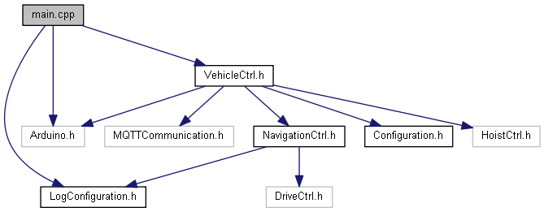
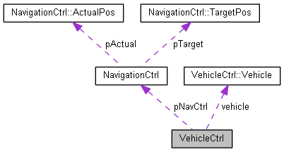

# SmartFactory_Vehicle-Sortic

The [SmartFactory_Vehicle-Sortic](<https://github.com/LMazzole/SmartFactory_Vehicle-Sortic>) is an implementation from the SmartFactory Project for Sortic.

It's a Smart-Vehicle which can navigate on a known game-table and communicates this information wirelessly to its environment using the [SmartFactory_MQTTCommunication](https://github.com/LMazzole/SmartFactory_MQTTCommunication) and the [SmartFactory_Vehicle-Basis](<https://github.com/LMazzole/SmartFactory_Vehicle-Basis>) -component.

 Multiple nested  Finite State Machines (FSM) based on the pattern of the [ArdFSM](<https://github.com/LMazzole/ArdFSM>) are used to control the processes.

<!-- add Pagebreak: 

 -->

## Table of Content

<!-- TOC Generated with https://magnetikonline.github.io/markdown-toc-generate/ -->

[TOC]

## The SmartFactory Project - Sortic

The implementation of the SmartFactory project  for Sortic looks like this:

The associated  Repositorys are:  
  [SmartFactory-Sortic](https://github.com/LMazzole/SmartFactory-Sortic)  
  [SmartFactory_Box-Sortic](https://github.com/LMazzole/SmartFactory_Box-Sortic)  
  [SmartFactory_Vehicle-Sortic](https://github.com/LMazzole/SmartFactory_Vehicle-Sortic)  
  [SmartFactory_Vehicle-Basis](https://github.com/LMazzole/SmartFactory_Vehicle-Basis)  
  [SmartFactory_MQTTCommunication](https://github.com/LMazzole/SmartFactory_MQTTCommunication)  

## Tools and Technologies

The source-code is written in C++.
To achieve this project, the following listed tools and technologies were used.

### Doxygen

Doxygen is used for the documentation of the source-code.  
An intorduction to *Doxygen* and how to install it can be found in the [ArdFSM-Repo](https://github.com/LMazzole/ArdFSM#documentation-with-doxygen).  

### VSCode PlatformIO

The used  IDE is [VSCode](https://code.visualstudio.com/) with the [PlatformIO](https://platformio.org/platformio-ide)-Extension.

### MQTT

For a description of the MQTT-Technologie take a look at the [MQTTCommunication-ReadMe](<https://github.com/LMazzole/SmartFactory_MQTTCommunication#mqtt>).   

# Documentation

## Hardware
For a description of the used Hardware  take a look at the [Vehicle-Basis-ReadMe](https://github.com/LMazzole/SmartFactory_Vehicle-Basis).   

## Gametable 
The Gametable consists of black lines on a white (light) background. It is composed of different sectors:

* Handover (Sortic/Transfer)

* Gateway (Sortic/Transfer)

* Waiting area

* Transit

* Parking

These sectors are also separate states and can easily be customized in [NavigationCtrl](https://lmazzole.github.io/SmartFactory_Vehicle-Sortic/class_navigation_ctrl.html).

## Software

All functions and files are documented on the [GitHub-Page with Doxygen](https://lmazzole.github.io/SmartFactory_Vehicle-Sortic/).  
The documentation includes also the [MQTTCommunication](<https://github.com/LMazzole/SmartFactory_MQTTCommunication>) and the [SmartFactory_Vehicle-Basis](https://github.com/LMazzole/SmartFactory_Vehicle-Basis)-Files.

It's important to mention that all functions are non blocking and as short as possible so no other process starves. This way a degree of parallelism can be achieved.

### Dependency Graph

Extern Libraries:  

- [SmartFactory_MQTTCommunication](<https://github.com/LMazzole/SmartFactory_MQTTCommunication>)
- [SmartFactory_Vehicle-Basis](https://github.com/LMazzole/SmartFactory_Vehicle-Basis)

### Collaboration Diagram

### Important Functions and Files

#### Configuration.h

In [Configuration.h](<https://lmazzole.github.io/SmartFactory_Vehicle-Sortic/_configuration_8h.html>) are all important settings for the Vehicle defined:  

* Time between the MQTT Publishs (TIME_BETWEEN_PUBLISH)
* How long the SmartVehicle for Box-Acknolegemnt  waits (TIMEOUT_VACKS)
* How many lines there are (SORTIC_MAX_LINE)
* The Hostname number (DEFAUL_HOSTNAME_NUMBER)
* The Hostname "SV"+ Hostnamenumber (DEFAULT_HOSTNAME)

### Communication 

The SmartVehicle communicates via the [SmartFactory_MQTTCommunication](<https://github.com/LMazzole/SmartFactory_MQTTCommunication>) to an MQTT-Broker, who distributes the messages. The communication works by subscribing to various topics. The subscribed Topics change depending on action and position of the Vehicle. The Topic-Tree looks like this:

The Vehicle is constantly subscribed to the topics: *error, Vehicle/error, Vehicle/vehicle.id/error* and also always publishes its status to *Vehicle/vehicle.id/status*. 

More information about the communication process and the complete procedure is documented in [SmartFactroy-Sortic-ReadMe](<https://github.com/LMazzole/SmartFactory-Sortic#smartfactory-sortic>). 

#### Handshake with Box

For an handshake with a box the topic *Vehicle/vehicle.id/handshake* is used. The Confirmation of the new position is send from the vehicle to the *Box/box.id/position*.

#### Transfer and Vehicle

Before the vehicle can bring the box to its new destination, it has to find out where its load is needed and whether that space is available. For this it subscribes to the Topic Transfer/Handover and evaluates the received messages.

## FAQ's

#### I'd like to use this code in my project. What do I need to know?  

> This Repository is specifically for Sortic. You can still use it, if you stick to the following rules:  
>
> * Use the same Handshake and Communication-Sequence for your carrier as documented in  [SmartFactory-Sortic](https://github.com/LMazzole/SmartFactory-Sortic) and [Communication](#communication).

### ToDo's
#### Software
All open ToDo's can be found in the Documentation on the [GitHub-Page](https://lmazzole.github.io/SmartFactory_Box-Sortic/todo.html)

## Contributors

- [Luca Mazzoleni](https://github.com/LMazzole)

## Changelog

V 1.0	-	Release BA FS19	-	[Luca Mazzoleni](https://github.com/LMazzole)

## License

[TODO]

